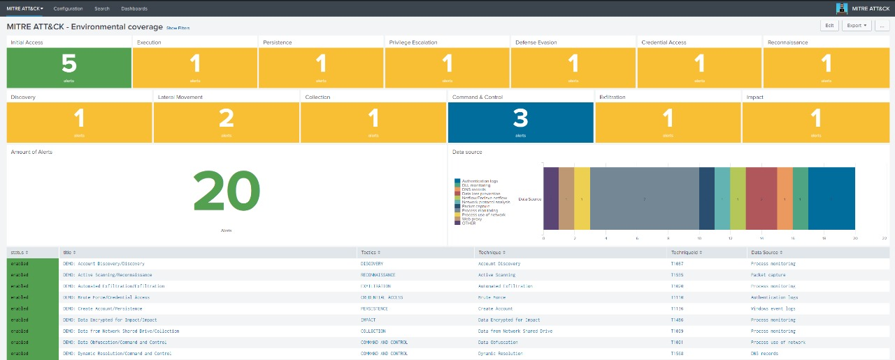

# Mitre ATT & CK

The purpose of the app is to show how much your environment covers the techniques and tactics of the miter attack, helping the SOC to direct the forces to areas that are less covered

Add an alert on the dashboard

Example of the completed panel

Example of the triggered alerts panel

If you want to use the demos alerts I used in the example, just rename the file **"default/savedsearches.conf.old"** to **"default/savedsearches.conf"**.

**Obs:** By default, alerts are summarized in the **"summary"** index, but you can change to the desired index by going to the app's settings.

