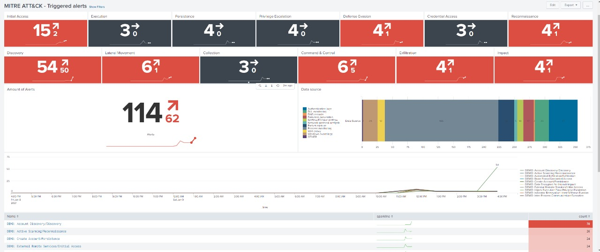

The purpose of the app is to show how much your environment covers the techniques and tactics of the miter attack, helping the SOC to direct the forces to areas that are less covered
# View of alerts enabled and categorized in Miter ATT & CK

Example of the completed panel

# View of the alerts that were triggered

